# Documentación de imágenes IA

## Imagen 1
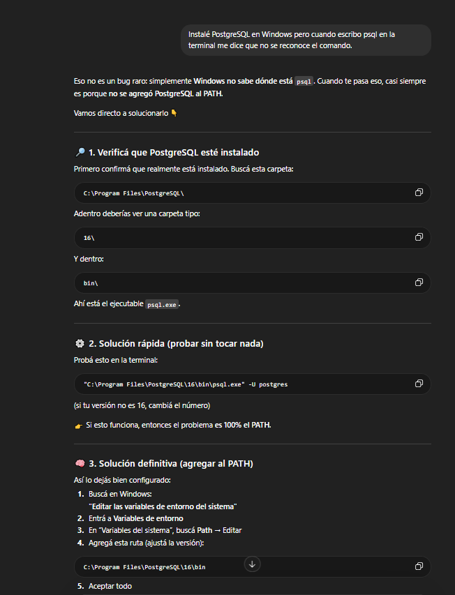

---

## Imagen 2
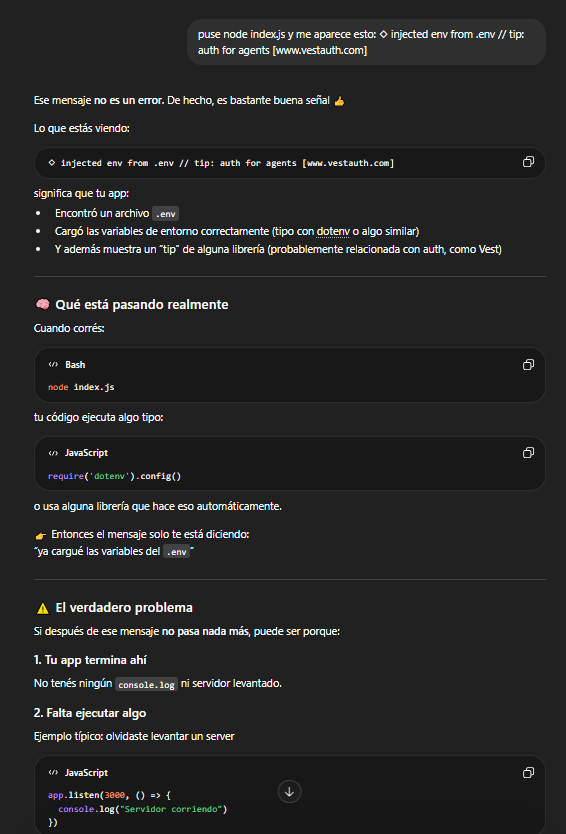

---

## Imagen 3
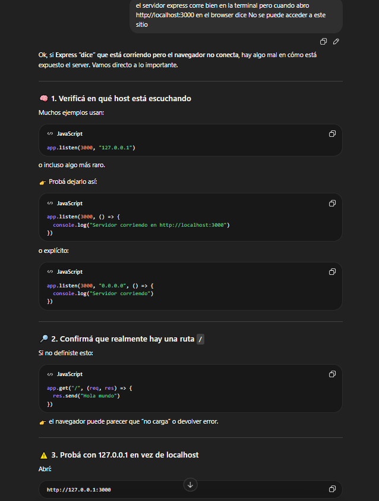

---

## Imagen 4
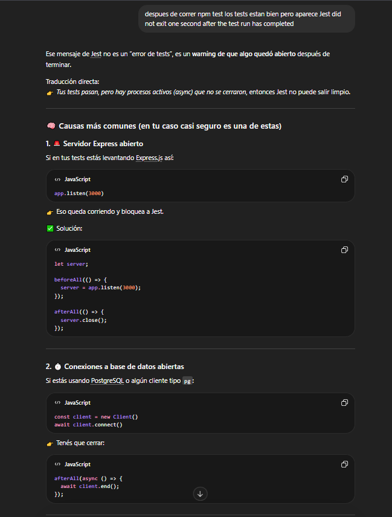

---

## Imagen 5
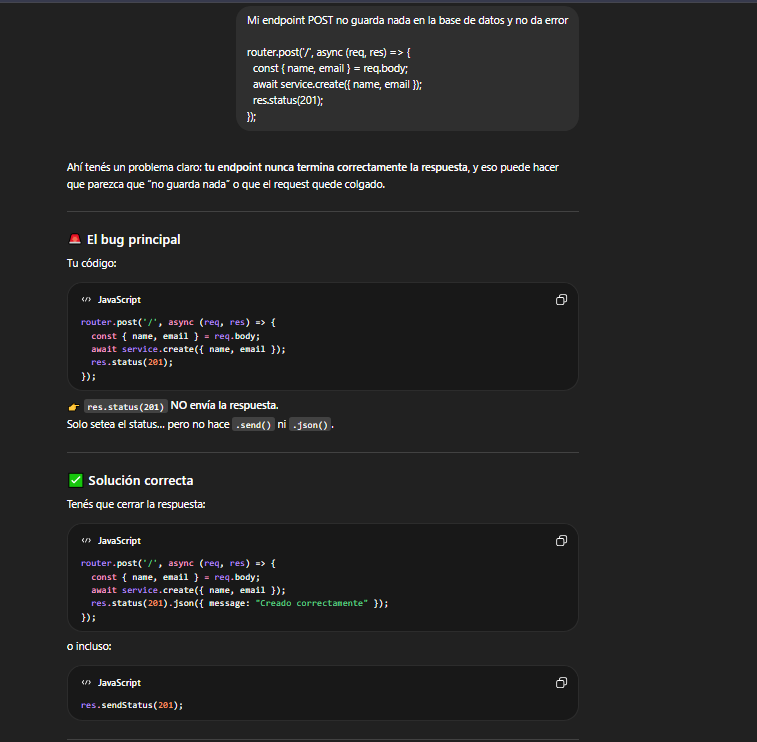

---

## Imagen 6
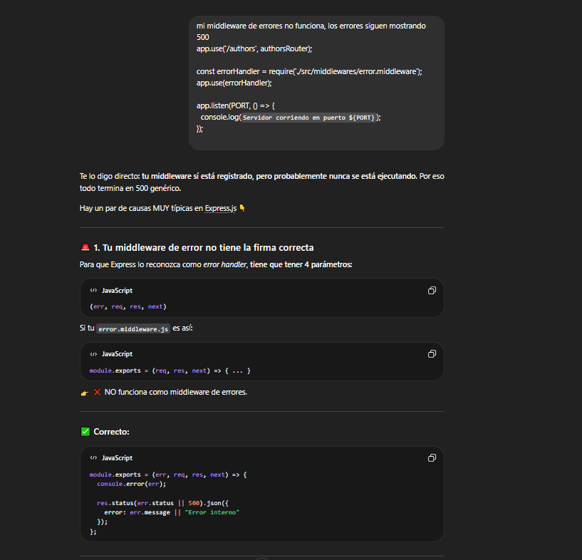

---

## Imagen 6.1
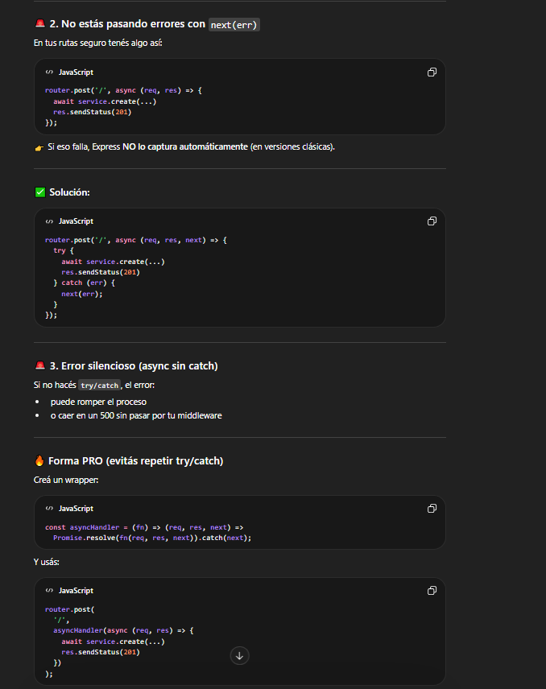

---

## Imagen 7
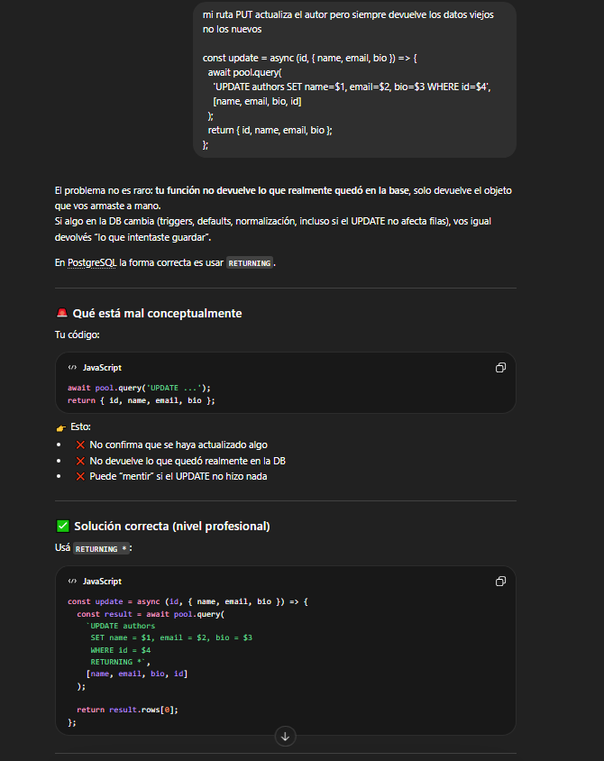

---

## Imagen 8
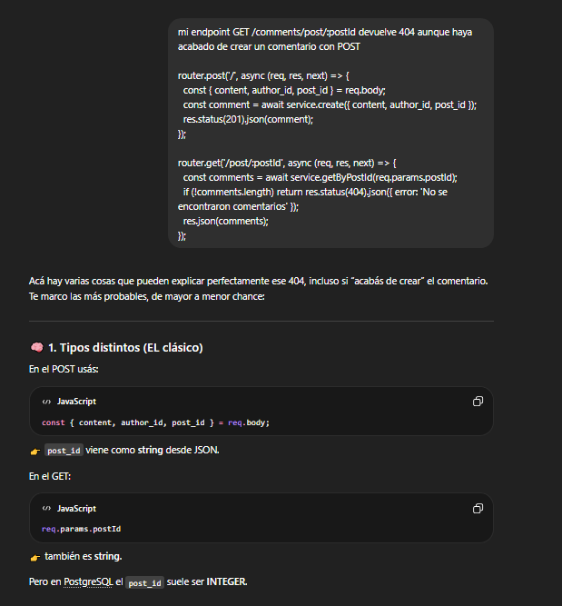

---

## Imagen 8.1
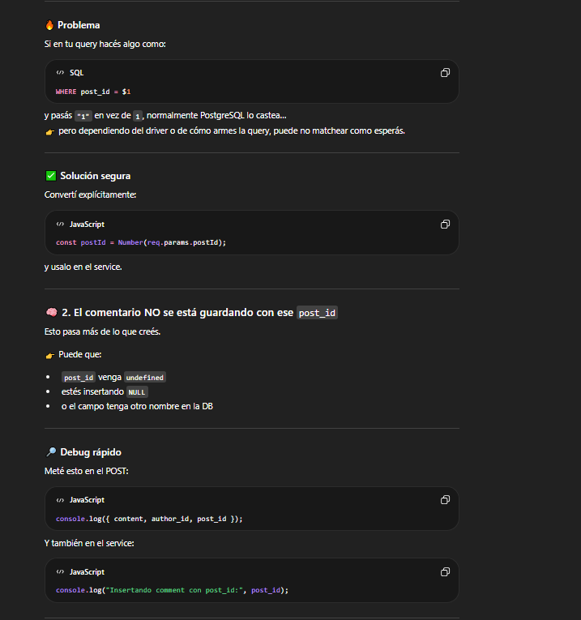

---

## Imagen 9
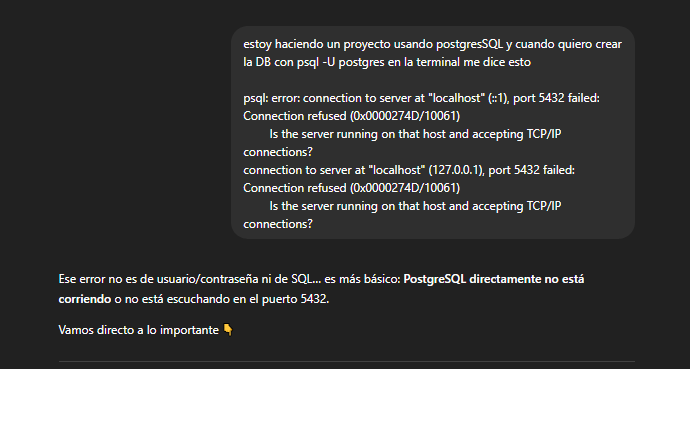

---

---

## Imagen 9.1
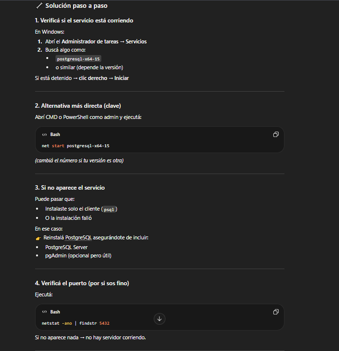

---

## Imagen 10
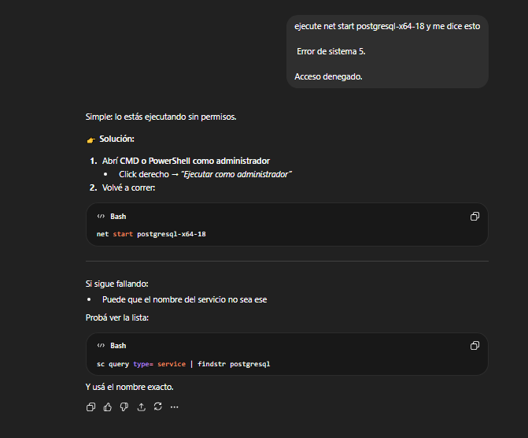

---

## Imagen 12
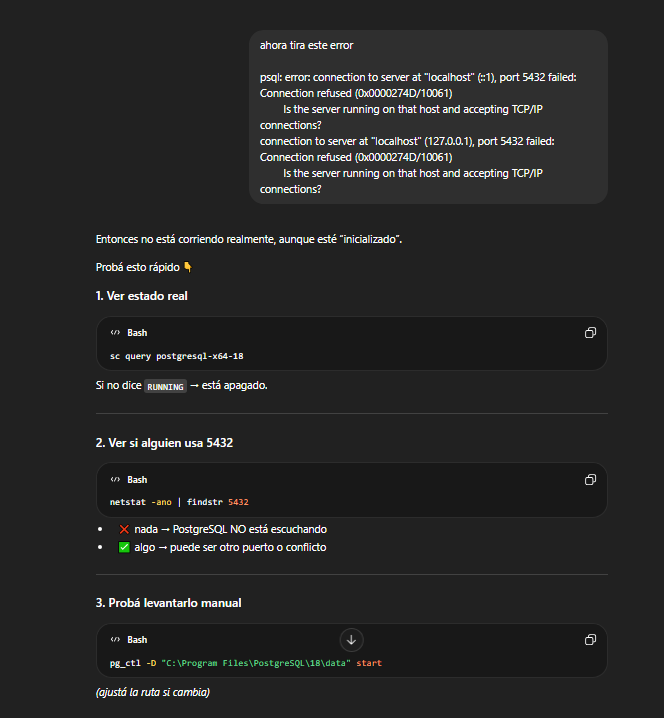

---

## Imagen 13
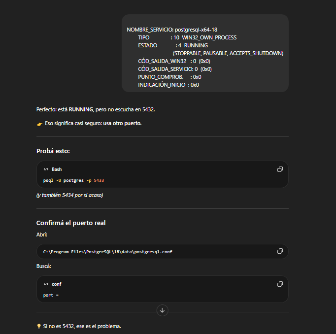

---

## Imagen 14
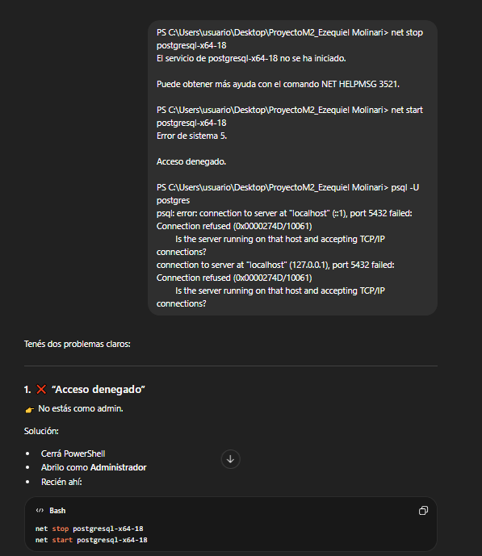

---

## Imagen 14.1
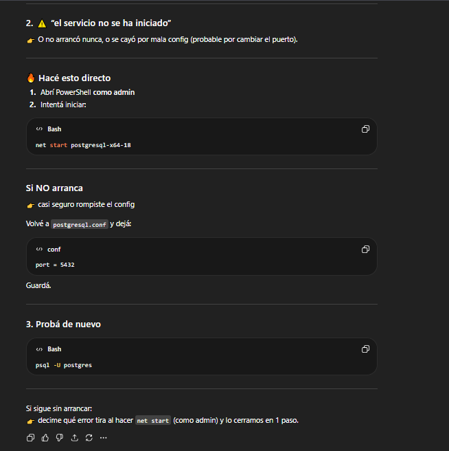

